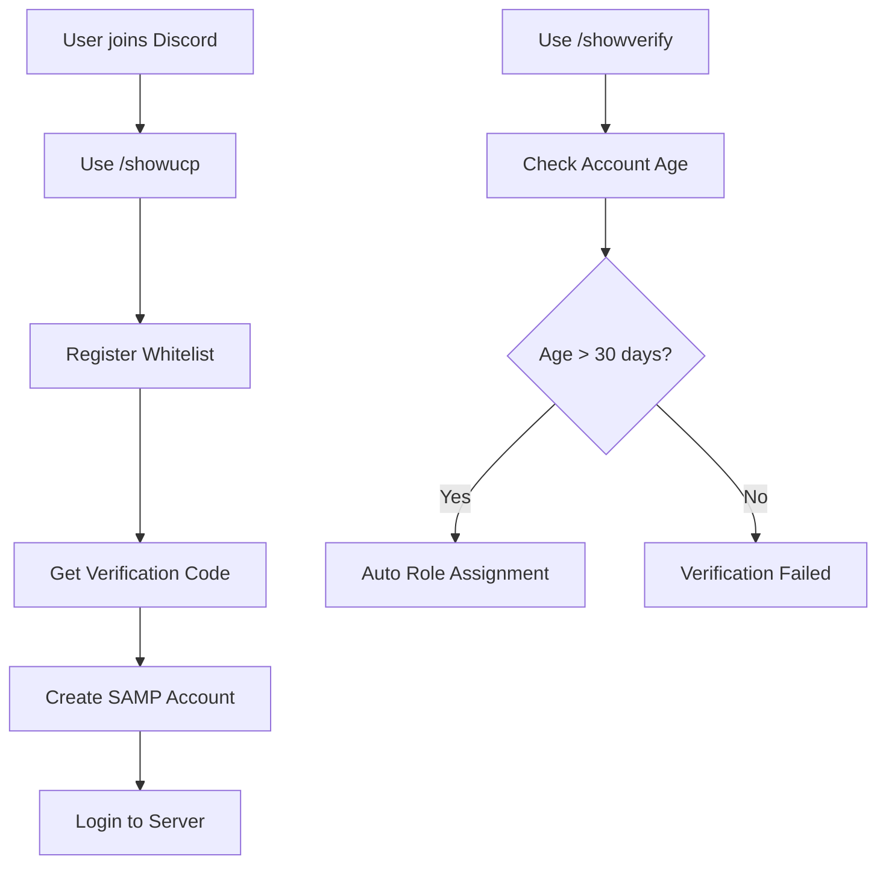

# 🎮 LeoXD SAMP Discord Bot

<div align="center">


**Advanced Discord Bot untuk SAMP Server dengan UCP Registration System**

[📥 Download](#-installation) • [🔧 Setup](#-quick-setup) • [📖 Documentation](#-features) • [�️ Database](#-database-compatibility) • [� Adaptation Guide](DATABASE_ADAPTATION_GUIDE.md) • [��🐛 Issues](https://github.com/LeoXD-tech/samp-discord-bot/issues)

### 🎯 **Gamemode Compatibility**

| Gamemode | Status | Setup Required |
|----------|--------|----------------|
| **Arivena** | ✅ **Ready** | Import database saja |
| **Other Gamemodes** | ⚠️ **Manual** | Sesuaikan query di `database/queries.js` |

</div>

---

## ✨ Features

### 🔐 **UCP Registration System**
- **Whitelist Management** - Sistem whitelist otomatis dengan role-based access
- **Account Registration** - Registrasi UCP dengan validasi Discord
- **Password Management** - Reset password dan regenerate verification code
- **Image Generation** - Auto-generate verification images dengan Canvas

### 🛡️ **Discord Verification**
- **Account Age Check** - Verifikasi umur akun Discord (30+ hari)
- **Anti-Double Verification** - Web-based verification untuk mencegah abuse
- **Auto Role Assignment** - Pemberian role otomatis setelah verifikasi
- **Session Management** - Sistem session dengan timeout otomatis

### 📊 **Server Monitoring**
- **SAMP Server Status** - Real-time monitoring server SAMP
- **Discord Member Stats** - Statistik member online/offline
- **Auto Updates** - Update status setiap 30 detik
- **Server Info Display** - Hostname, player count, gamemode

### 🎨 **Emoji & Sticker Management**
- **Custom Emoji** - Add emoji dari URL dengan validasi
- **Sticker Management** - Upload dan manage server stickers
- **Batch Operations** - Multiple emoji/sticker operations
- **Error Handling** - Comprehensive error handling dan user feedback

### 🤖 **Auto Response System**
- **Keyword Detection** - Auto-response untuk keyword tertentu
- **Cooldown Management** - Anti-spam dengan user cooldown
- **Admin Commands** - Manage auto-responses via Discord commands

## � Screenshots

### 🎮 UCP Registration Panel

*Modern registration interface dengan whitelist management dan verification system*

### 🛡️ Discord Verification System

*Account age verification dengan auto role assignment untuk mencegah fake accounts*

### 📊 Server Monitoring Dashboard

*Real-time SAMP server status, player count, dan Discord member statistics*

### 🎨 Emoji & Sticker Management

*Comprehensive emoji dan sticker management dengan URL upload dan batch operations*

### 🤖 Auto Response System

*Smart auto-response system dengan keyword detection dan anti-spam cooldown*

---

## 🚀 Quick Setup

### Prerequisites
- **Node.js** v16.0.0 atau lebih tinggi
- **MySQL/MariaDB** database server
- **Discord Bot Token** dari [Discord Developer Portal](https://discord.com/developers/applications)

### ⚡ One-Click Installation

1. **Clone Repository**
   ```bash
   git clone https://github.com/LeoXD-tech/samp-discord-bot.git
   cd samp-discord-bot
   ```

2. **Install Dependencies**
   ```bash
   # Windows
   install-dependencies.bat

   # Linux/Mac
   npm install
   ```

3. **Configure Bot**
   ```javascript
   // Edit config/config.js
   discord: {
       token: 'YOUR_BOT_TOKEN_HERE',
       guildId: 'YOUR_GUILD_ID_HERE',
       clientId: 'YOUR_CLIENT_ID_HERE'
   },
   database: {
       host: 'localhost',
       user: 'root',
       password: 'your_password',
       database: 'your_database_name'
   }
   ```

4. **Setup Database**

   **For Arivena Gamemode:**
   ```sql
   -- Gunakan database gamemode Arivena yang sudah ada
   -- Bot sudah dikonfigurasi untuk struktur database Arivena
   -- Edit config/config.js dengan database credentials Anda
   ```

   **For Other Gamemodes:**
   ```sql
   -- Import template schema (opsional)
   mysql -u root -p your_database < database/schema_template.sql
   -- Atau gunakan database gamemode yang sudah ada
   -- Sesuaikan query di database/queries.js
   ```

5. **Start Bot**
   ```bash
   # Windows
   start.bat

   # Linux/Mac
   npm start
   ```

### 🎯 Advanced Configuration

### 🗄️ **Database Compatibility**

<details>
<summary><b>📊 Arivena Gamemode (Plug & Play)</b></summary>

Bot ini **sudah siap pakai** untuk gamemode **Arivena** karena:
- ✅ Query sudah disesuaikan dengan struktur Arivena
- ✅ Table names dan columns sudah match
- ✅ Gunakan database gamemode Arivena yang sudah ada

**Setup untuk Arivena:**
1. Gunakan database gamemode Arivena yang sudah ada
2. Edit `config/config.js` dengan database credentials Anda
3. Jalankan bot: `start.bat`

</details>

<details>
<summary><b>🔧 Other Gamemodes (Manual Adaptation)</b></summary>

Untuk gamemode lain, Anda perlu **menyesuaikan query** di `database/queries.js`:

**Step 1: Cek Struktur Database Gamemode Anda**
```sql
-- Cek table yang ada
SHOW TABLES;

-- Cek struktur table accounts/players
DESCRIBE accounts;  -- atau players, users, dll

-- Cek struktur table whitelist (jika ada)
DESCRIBE whitelist;
```

**Step 2: Sesuaikan Query di `database/queries.js`**

**Contoh untuk Gamemode Lain:**
```javascript
// Jika gamemode Anda menggunakan table 'players' bukan 'player_ucp'
checkWhitelist: `
    SELECT * FROM whitelist
    WHERE discord_id = ? OR username = ?
`,

// Jika gamemode Anda menggunakan column 'Password' bukan 'password'
createUCPAccount: `
    INSERT INTO players (Name, Password, Email, RegisterDate, DiscordID)
    VALUES (?, ?, ?, NOW(), ?)
`,

// Sesuaikan dengan struktur table gamemode Anda
getPlayerData: `
    SELECT Name, Password, Email, RegisterDate
    FROM players
    WHERE Name = ? OR DiscordID = ?
`
```

**Step 3: Update Table Names**
Edit file `database/queries.js` dan ganti:
- `player_ucp` → nama table player gamemode Anda
- `whitelists` → nama table whitelist gamemode Anda
- `player_characters` → nama table character gamemode Anda

**Step 4: Update Column Names**
Sesuaikan nama kolom:
- `username` → `Name`, `PlayerName`, dll
- `password` → `Password`, `Pass`, dll
- `discord_id` → `DiscordID`, `Discord`, dll

**Step 5: Test Query**
```sql
-- Test query manual sebelum menjalankan bot
SELECT * FROM your_table_name WHERE your_column = 'test';
```

</details>

<details>
<summary><b>🎮 Popular Gamemode Examples</b></summary>

**Contoh Adaptasi untuk Gamemode Populer:**

**1. Roleplay Gamemode (Generic)**
```javascript
// Table biasanya: accounts, players, users
checkWhitelist: `SELECT * FROM accounts WHERE DiscordID = ?`,
createUCPAccount: `INSERT INTO accounts (Name, Password, Email, RegisterDate, DiscordID) VALUES (?, ?, ?, NOW(), ?)`
```

**2. Freeroam/DM Gamemode**
```javascript
// Table biasanya: players, stats
checkWhitelist: `SELECT * FROM players WHERE Discord = ?`,
createUCPAccount: `INSERT INTO players (PlayerName, Pass, Email, RegDate, Discord) VALUES (?, ?, ?, NOW(), ?)`
```

**3. Custom Gamemode**
```javascript
// Sesuaikan dengan struktur database gamemode Anda
// Cek dengan: SHOW TABLES; dan DESCRIBE table_name;
```

**⚠️ Important Notes:**
- Backup database sebelum testing
- Test di development server terlebih dahulu
- Pastikan semua query berjalan tanpa error
- Cek log bot untuk error messages

</details>

<details>
<summary><b>🔧 Detailed Configuration Options</b></summary>

#### Discord Settings
```javascript
discord: {
    token: 'YOUR_BOT_TOKEN',
    guildId: 'YOUR_GUILD_ID',
    adminRoleId: 'ADMIN_ROLE_ID',
    registeredRoleId: 'REGISTERED_ROLE_ID',
    monitoringChannelId: 'MONITORING_CHANNEL_ID',
    minAccountAgeDays: 30
}
```

#### Database Configuration
```javascript
database: {
    host: 'localhost',
    user: 'root',
    password: 'your_password',
    database: 'your_database',
    port: 3306,
    connectionLimit: 10
}
```

#### UCP System Settings
```javascript
ucp: {
    verification: {
        codeLength: 8,
        codeExpiry: 24 * 60 * 60 * 1000, // 24 hours
        allowedAttempts: 3
    },
    password: {
        minLength: 6,
        maxLength: 50
    }
}
```

#### Server Monitoring
```javascript
serverMonitoring: {
    enabled: true,
    ip: '204.10.193.170',
    port: 7777,
    updateInterval: 30000, // 30 seconds
    channelId: 'MONITORING_CHANNEL_ID'
}
```

</details>

---

## 📋 Commands Reference

### 👤 User Commands
| Command | Description | Usage |
|---------|-------------|-------|
| `/showucp` | UCP Registration Panel | Buka panel registrasi whitelist |
| `/showverify` | Discord Verification | Verifikasi umur akun Discord |
| `/showemoji` | Emoji Management | Manage server emoji dan stickers |
| `/discordstats` | Discord Statistics | Lihat statistik server Discord |

### 🔧 Admin Commands
| Command | Description | Usage |
|---------|-------------|-------|
| `/addemoji` | Add Custom Emoji | Upload emoji dari URL |
| `/autoresponse` | Auto Response Settings | Manage auto-response system |
| `/serverstatus` | Server Status Check | Manual server status check |

### 🎮 UCP System Workflow



---

## 🛠️ Development & Customization

### 📁 Project Structure
```
samp-discord-bot/
├── 📁 commands/           # Slash commands
├── 📁 config/            # Configuration files
├── 📁 database/          # Database connection & schema
├── 📁 handlers/          # Event & interaction handlers
├── 📁 ucp/              # UCP system modules
│   ├── 📁 registration/  # Registration workflow
│   ├── 📁 verification/  # Verification handling
│   └── 📁 management/    # Account management
├── 📁 utils/            # Utility functions
├── 📁 web/              # Web verification system
├── 🚀 bot.js            # Main bot entry point
└── 📦 package.json      # Dependencies
```

### 🔧 Adding Custom Features

<details>
<summary><b>Adding New Commands</b></summary>

1. Create command file in `commands/` directory:
```javascript
// commands/mycommand.js
const { SlashCommandBuilder } = require('discord.js');

module.exports = {
    data: new SlashCommandBuilder()
        .setName('mycommand')
        .setDescription('My custom command'),
    async execute(interaction) {
        await interaction.reply('Hello World!');
    }
};
```

2. Register in `handlers/eventHandler.js`
</details>

<details>
<summary><b>Database Modifications</b></summary>

1. Update `database/queries.js` with new queries
2. Update connection handling in `database/connection.js`
3. Test queries dengan database gamemode Anda
</details>

### 🎨 Customization Options

- **🎨 Embed Colors**: Modify `config.js` → `embedColors`
- **⏱️ Cooldowns**: Adjust command cooldowns in `config.js`
- **🔐 Permissions**: Update role IDs in `config.js`
- **📊 Monitoring**: Configure server monitoring intervals
- **🤖 Auto Responses**: Add custom keyword responses

---

## � Troubleshooting

### Common Issues & Solutions

<details>
<summary><b>❌ Bot tidak merespon commands</b></summary>

**Possible Causes:**
- Bot token salah atau expired
- Bot tidak memiliki permission yang cukup
- Guild ID tidak sesuai

**Solutions:**
1. Cek bot token di Discord Developer Portal
2. Invite bot dengan permission `Administrator`
3. Pastikan `guildId` di config sesuai dengan server Discord
</details>

<details>
<summary><b>❌ Database connection error</b></summary>

**Possible Causes:**
- MySQL server tidak running
- Database credentials salah
- Database tidak exist
- Query tidak sesuai dengan struktur gamemode

**Solutions:**
1. Start MySQL service: `net start mysql` (Windows)
2. Cek username/password di `config/config.js`
3. Create database: `CREATE DATABASE your_database_name;`
4. **Untuk Arivena**: Gunakan database gamemode Arivena yang sudah ada
5. **Untuk Gamemode Lain**: Sesuaikan query di `database/queries.js`
</details>

<details>
<summary><b>❌ Query/Table not found error</b></summary>

**Possible Causes:**
- Table names tidak sesuai dengan gamemode
- Column names berbeda
- Database structure tidak match

**Solutions:**
1. Cek struktur database: `SHOW TABLES;`
2. Cek kolom table: `DESCRIBE table_name;`
3. Edit `database/queries.js` sesuai struktur gamemode Anda
4. Update table names dan column names
5. Test query manual di MySQL sebelum menjalankan bot
</details>

<details>
<summary><b>❌ Canvas/Image generation error</b></summary>

**Possible Causes:**
- Canvas package tidak terinstall
- Missing system dependencies

**Solutions:**
1. Install canvas: `npm install canvas`
2. Windows: Install Visual Studio Build Tools
3. Linux: `sudo apt-get install build-essential libcairo2-dev libpango1.0-dev libjpeg-dev libgif-dev librsvg2-dev`
</details>

### 📞 Support

- 🐛 **Bug Reports**: [Create Issue](https://github.com/LeoXD-tech/samp-discord-bot/issues)
- 💡 **Feature Requests**: [Discussions](https://github.com/LeoXD-tech/samp-discord-bot/discussions)
- � **Database Help**: [Adaptation Guide](DATABASE_ADAPTATION_GUIDE.md)
- �📧 **Contact**: leoxd@gmail.com

---

## 🚀 Production Deployment

### 🖥️ **VPS/Server Deployment**

<details>
<summary><b>Windows Server Deployment</b></summary>

1. **Install Prerequisites**
   ```cmd
   # Install Node.js LTS
   # Install MySQL Server
   # Install Git (optional)
   ```

2. **Setup Bot**
   ```cmd
   git clone https://github.com/LeoXD-tech/samp-discord-bot.git
   cd samp-discord-bot
   install-dependencies.bat
   ```

3. **Configure for Production**
   ```javascript
   // config/config.js
   database: {
       host: 'your-mysql-server',
       user: 'bot_user',
       password: 'secure_password',
       database: 'production_db'
   }
   ```

4. **Run as Service**
   ```cmd
   # Install PM2 for Windows
   npm install -g pm2
   pm2 start bot.js --name "samp-discord-bot"
   pm2 startup
   pm2 save
   ```

</details>

<details>
<summary><b>Linux Server Deployment</b></summary>

1. **Install Prerequisites**
   ```bash
   # Ubuntu/Debian
   sudo apt update
   sudo apt install nodejs npm mysql-server git

   # CentOS/RHEL
   sudo yum install nodejs npm mysql-server git
   ```

2. **Setup Bot**
   ```bash
   git clone https://github.com/LeoXD-tech/samp-discord-bot.git
   cd samp-discord-bot
   npm install
   ```

3. **Configure Database**
   ```bash
   sudo mysql_secure_installation
   mysql -u root -p
   CREATE DATABASE samp_bot;
   CREATE USER 'bot_user'@'localhost' IDENTIFIED BY 'secure_password';
   GRANT ALL PRIVILEGES ON samp_bot.* TO 'bot_user'@'localhost';
   FLUSH PRIVILEGES;
   ```

4. **Run with PM2**
   ```bash
   sudo npm install -g pm2
   pm2 start bot.js --name "samp-discord-bot"
   pm2 startup
   pm2 save
   ```

</details>

### 🔒 **Security Best Practices**

- ✅ Use strong database passwords
- ✅ Create dedicated MySQL user for bot
- ✅ Enable MySQL SSL if possible
- ✅ Keep bot token secure (never commit to git)
- ✅ Regular database backups
- ✅ Monitor bot logs for suspicious activity
- ✅ Update dependencies regularly

### 📊 **Performance Optimization**

- 🚀 **Database**: Use connection pooling (already configured)
- 🚀 **Memory**: Monitor with `pm2 monit`
- 🚀 **CPU**: Bot is lightweight, minimal CPU usage
- 🚀 **Network**: Efficient Discord API usage with rate limiting
- 🚀 **Storage**: Regular log rotation and cleanup

## 🚨 Important Notes

1. **Security**: Never commit sensitive configuration data
2. **Database**: Ensure proper database backups
3. **Permissions**: Set appropriate Discord bot permissions
4. **Monitoring**: Monitor bot logs for errors and issues

## 📝 License

This project is licensed under the MIT License.

## 🤝 Contributing

1. Fork the repository
2. Create a feature branch
3. Make your changes
4. Test thoroughly
5. Submit a pull request

## 📞 Support

For support and questions, please contact the development team or create an issue in the repository.
